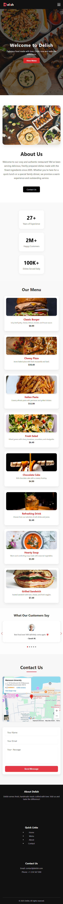

# 🍽️ Delish Restaurant Landing Page
A fully responsive and modern landing page for a fictional restaurant, built as part of Level One of my web development learning path. This project focuses on clean design, responsive layout, animation, accessibility, SEO, and deployment best practices.


## 🚀 *Live Demo*
<!-- [View Live](https://ahmedhafez7-eng.github.io/restaurant-landing-page/) -->
🔗 View it here: https://ahmedhafez7-eng.github.io/restaurant-landing-page/

---
### ✨ *Features*
- ✅ Responsive layout for all screen sizes (desktop, tablet, mobile)

- 🖼️ Hero section with background image/video and call to action

- 🧾 About Us section with split image + text layout

- 🍔 Menu section with responsive animated cards

- 💬 Testimonials slider with avatar and smooth transition

- 📞 WhatsApp button integration for direct chat

- ⌛ Custom animated loader with logo and “Loading Delish…” message

- 📊 Animated statistics counters (CountUp.js)

- 🎯 Scroll-triggered animations (e.g., fade-ins)

- 📍 Contact Us section with embedded Google Map and contact form

- 📱 Mobile-first navigation with hamburger menu

- ⚙️ SEO-optimized with proper meta tags and structure

- 📡 Deployed live using GitHub Pages

---
### 🛠️ *Technologies Used*
* HTML5 + CSS3

* JavaScript (ES6)

* CSS Grid & Flexbox

* CountUp.js (for animated counters)

* Git & GitHub (version control)

* GitHub Pages (deployment)

* AOS.js (optional scroll animations)

* Chrome DevTools & Lighthouse for performance tuning
---
### 📁 *Folder Structure*
```
restaurant-landing-page/
├── index.html
├── css/
│   └── style.css
├── js/
│   └── main.js
├── images/
│   └── logo.png
│   └── background.jpg
│   └── testimonial1.jpg
│   └── ...
├── README.md
```
<!-- ---
### 📷 *Screenshots*

| Desktop View |
|--------------|


| Mobile View |
|-------------|
 -->


---
### 🧪 Lighthouse Report

| Category          |     Score   |
|-------------------|-------------|
| Performance       |	   94     |
| Accessibility     |	   91     |
| Best Practices    |	   74     |
| SEO	            |      100    |

---
### ✅ Objectives Achieved

1. Build a modern, real-world UI from scratch

2. Practice full responsive layout techniques

3. Apply semantic HTML structure

4. Use interactive JS for animation and counters

5. Optimize for SEO, accessibility, and performance

6. Practice deployment workflow using Git and GitHub Pages

---
### 💡 Future Enhancements

- Add real-time contact form integration (e.g. Formspree or Laravel backend)

- Use dynamic data for menu and testimonials

- Add language selector for multilingual support

- Replace loader with animated Lottie version

---
<!-- ## 📝 License
This project is licensed under the MIT License — feel free to use, modify, or build on it! -->

##👤 Author

**🧑‍💻 Developed by Ahmed Hafez**

**🚀 Level One Project – Full Web Development Learning Roadmap**